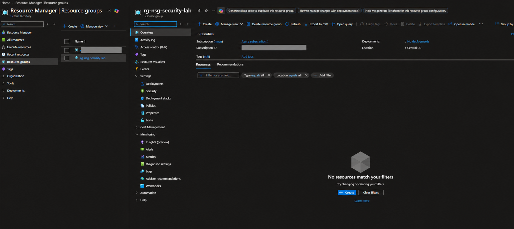
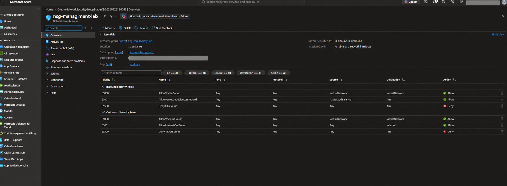
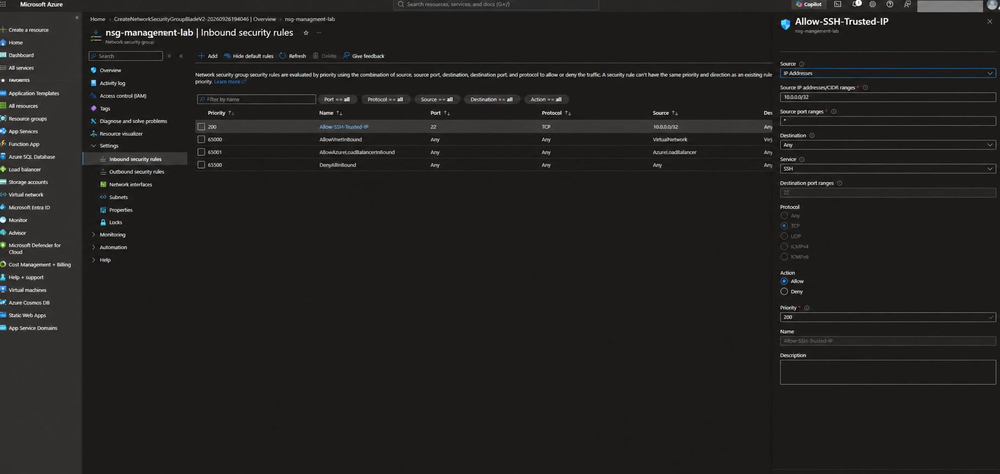

# Azure Network Security Group: Restricted SSH Access


## Project summary

This cloud-security lab demonstrates how I created an Azure Network Security Group (NSG), reviewed its default inbound and outbound rules, and added a custom rule that permits SSH only from one private `/32` source address.

The goal was to practice **least-access networking**: allow only the protocol, port, and source required for administration instead of exposing SSH to every internet address.

## Skills demonstrated

- Azure Network Security Group administration
- Inbound and outbound traffic filtering
- Rule-priority evaluation
- TCP/IP, ports, and CIDR notation
- Restricting administrative access
- Default-deny security design
- Cloud-resource organization and cleanup
- Security evidence documentation

## Lab configuration

| Setting | Value |
|---|---|
| Project date | September 14, 2026 |
| Resource group | `rg-nsg-security-lab` |
| Network security group | `nsg-management-lab` |
| Azure region | Central US |
| Custom rule | `Allow-SSH-Trusted-IP` |
| Direction | Inbound |
| Protocol | TCP |
| Destination port | 22 (SSH) |
| Source | `10.0.0.0/32` |
| Action | Allow |
| Priority | 200 |
| Workload association | None—lab NSG was not attached to a subnet or network interface |

## Security design

```text
Trusted lab source
   10.0.0.0/32
        |
        | TCP 22
        v
Allow-SSH-Trusted-IP
   Priority: 200
        |
        v
nsg-management-lab
        |
        +-- Allow matching SSH traffic
        +-- Evaluate Azure default rules for other traffic
        +-- Deny unmatched inbound traffic at priority 65500
```

Azure evaluates NSG rules from the lowest priority number to the highest. The custom rule at priority `200` is evaluated before Azure's default rules at priorities `65000`–`65500`. Once traffic matches a rule, evaluation stops.

## Implementation

### 1. Create a dedicated resource group

I created `rg-nsg-security-lab` in Central US to isolate the lab resources from unrelated workloads. A dedicated resource group simplifies organization, access control, cost review, and cleanup.



### 2. Create and inspect the NSG

I created `nsg-management-lab` and reviewed the automatically generated rules. The initial NSG contained no custom rules and was not associated with a subnet or network interface.

Important default inbound rules included:

- `AllowVnetInBound` at priority `65000`
- `AllowAzureLoadBalancerInBound` at priority `65001`
- `DenyAllInBound` at priority `65500`



### 3. Add a restricted SSH rule

I added `Allow-SSH-Trusted-IP` with priority `200`. The rule permits only TCP port `22` from the single private lab address `10.0.0.0/32`.



Using `/32` limits the rule to one IPv4 address. This is more restrictive than `0.0.0.0/0`, which would permit connection attempts from the entire IPv4 internet.

## Validation results

- The rule used TCP rather than all protocols.
- The destination was limited to SSH port 22.
- The source was limited to one `/32` address.
- Priority 200 placed the custom rule ahead of Azure's default rules.
- The NSG remained unassociated with a subnet or network interface, preventing the lab rule from affecting an existing workload.
- No VM or other compute resource was deployed.

## Important limitation

This project validates **NSG configuration and rule logic**, not end-to-end SSH connectivity. An NSG does not filter workload traffic until it is associated with a subnet or network interface. A future extension should attach the NSG to an isolated test subnet or NIC, test approved and denied traffic, and review the resulting logs.

Also, `10.0.0.0/32` is a private lab address. In a real environment, the correct source would depend on the design—for example, a specific internal management host, VPN address range, Azure Bastion path, or another approved administrative network.

## Troubleshooting approach

If an authorized administrator still could not connect through SSH, I would check:

1. Whether the NSG is associated with the intended subnet or network interface.
2. Whether the administrator's actual source IP matches the rule.
3. Whether a higher-priority deny rule blocks the connection.
4. Whether subnet-level and NIC-level NSGs both permit the traffic.
5. Whether the VM has a valid route and reachable private or public endpoint.
6. Whether SSH is listening on TCP port 22.
7. Whether the guest operating-system firewall permits the connection.
8. Whether authentication, keys, or user configuration is failing after the network connection succeeds.

## Security lessons learned

- An NSG must be associated with a subnet or NIC before it can enforce traffic rules.
- Lower priority numbers are evaluated first.
- Administrative ports should never be opened broadly without a documented requirement.
- A `/32` represents one IPv4 address and is useful for tightly scoped access.
- NSGs control network traffic; they do not replace host firewalls, strong authentication, patching, or RBAC.
- Public portfolio screenshots should redact account names, tenant information, subscription IDs, and unrelated resources.

## Cleanup

After documenting the results:

1. Confirm the NSG is not associated with a required subnet or network interface.
2. Delete `nsg-management-lab`.
3. Delete `rg-nsg-security-lab` if it contains no other required resources.
4. Verify the lab resources no longer appear in Azure.

## Interview talking point

> I created an Azure Network Security Group lab to practice secure administrative access. I reviewed Azure's default rules and added a priority-200 inbound rule allowing TCP port 22 from only one `/32` source instead of the entire internet. I also verified that the NSG was not attached to a production subnet or NIC. The exercise strengthened my understanding of CIDR scoping, rule priority, default-deny behavior, and the difference between configuring an NSG and actually enforcing it on a workload.

## Repository structure

```text
Azure-Network-Security-Group-Lab/
├── README.md
├── SECURITY.md
├── portfolio-description.md
├── docs/
│   └── improvement-plan.md
└── images/
    ├── 01-resource-group-created.png
    ├── 02-nsg-default-rules.png
    └── 03-restricted-ssh-rule.png
```

